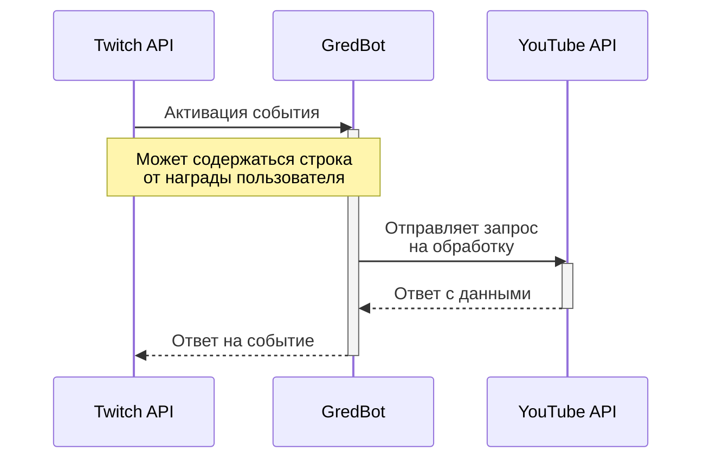
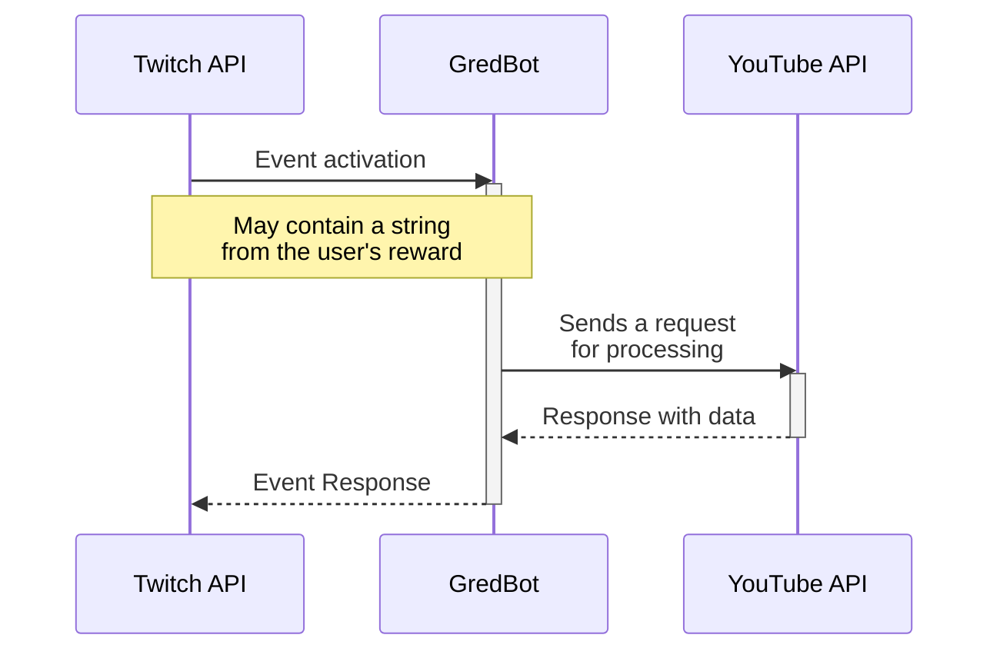

# 
 GredBot
 
___

## RU:
Бесплатное и простое программное обеспечение для улучшение качества ваших прямых трансляций. Скачайте и получите новый и удивительный опыт ведений прямых трансляций

### Основные функции
Данная программа имеет интеграции, которые позволяет взаимодействовать между зрителями и ведущим трансляции через баллы канала **Twitch**, заказывать или пропускать музыку из **YouTube**
 
Есть возможность добавить виджет плеера через источник в **OBS** и прочие стриминговые программы

Есть различные настройки и прочие дополнительные функции, для фильтрации заказываемых треков
 
Так же есть возможность загрузить плейлист из **Youtube**, вставив ссылку

### Скриншоты
|Панель управления (История)|Панель управления (Плейлисты)|Плеер|
|---------------------------|-----------------------------|-----|
||||

### Обратная связь
Если у Вас возникли какие-то вопросы, пробемы и прочие затруднения, можете написать [здесь](https://github.com/CoMFliP/gred-bot/issues/new) или написать мне на e-mail: comflipcontact@gmail.com

___

## EN:
> [!WARNING]  
> Currently there is no English language, more languages ​​are planned to be added in future updates
 

Free and simple software to improve the quality of your live broadcasts. Download and get a new and amazing live streaming experience

### Main features
This program has integrations that allow you to interact between viewers and the broadcast host through **Twitch** channel points, order or skip music from **YouTube**
 
It is possible to add a player widget via source to **OBS** and other streaming programs

There are various settings and other additional functions for filtering ordered tracks
 
It is also possible to download a playlist from **Youtube** by inserting a link

### Screenshots
|Control Panel (History)|Control Panel (Playlists)|Player|
|-----------------------|-------------------------|------|
||||

### Feedback
If you have any questions, problems or other difficulties, you can write [here](https://github.com/CoMFliP/gred-bot/issues/new) or write to me by e-mail: comflipcontact@gmail.com

___

